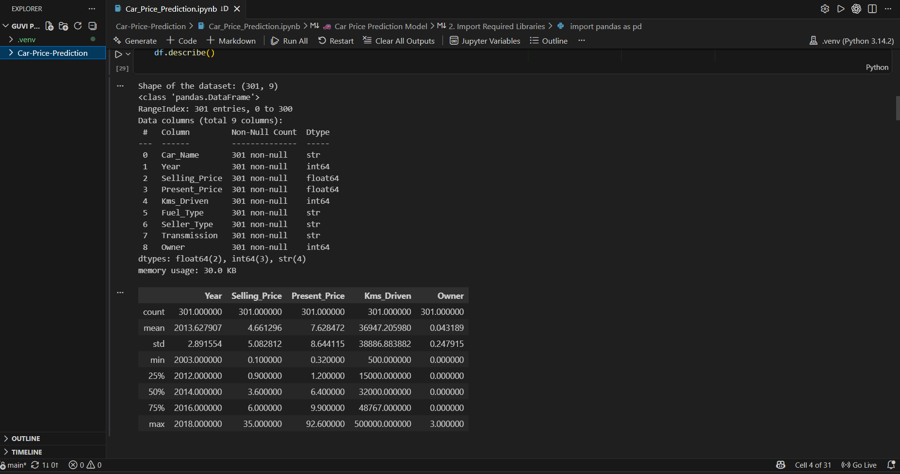
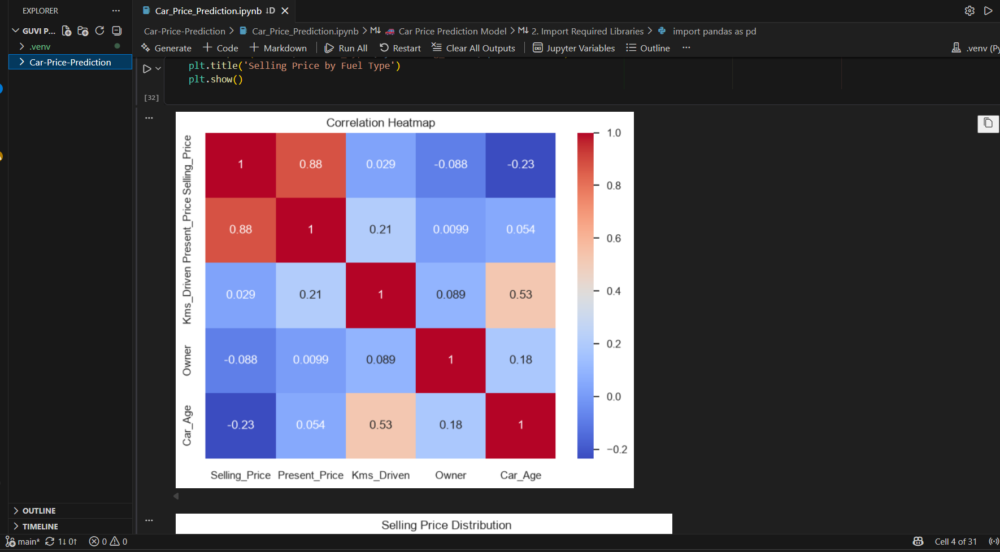
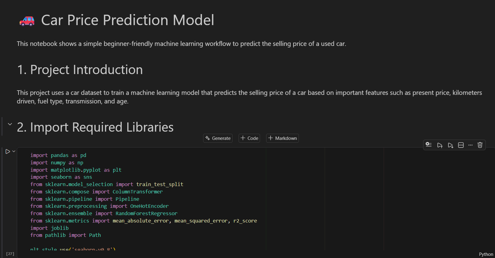
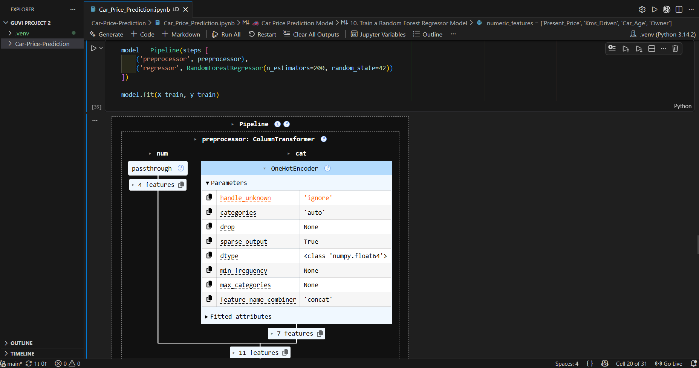
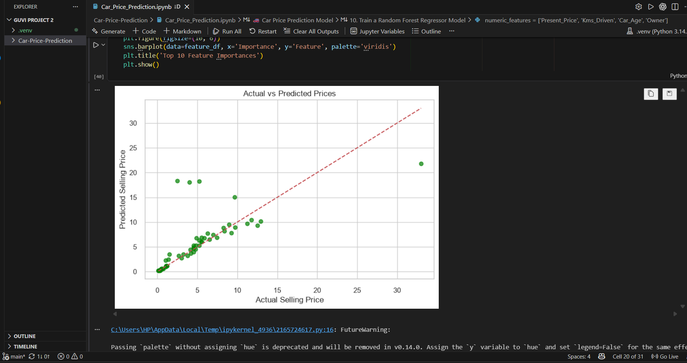
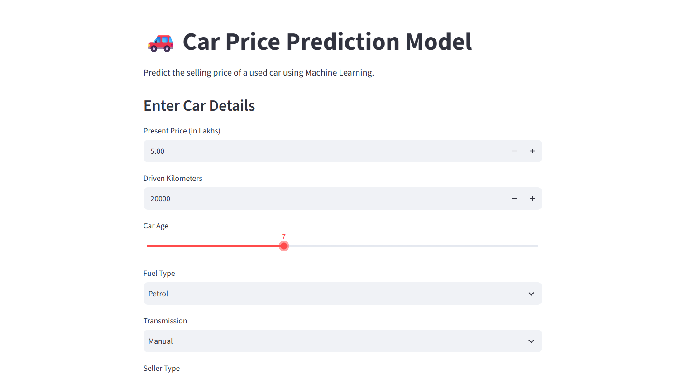
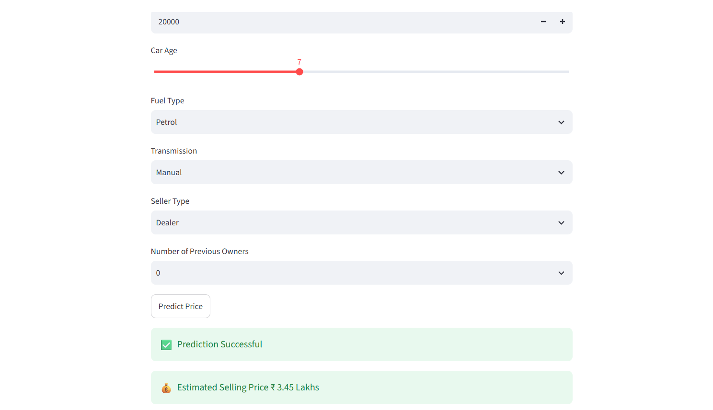

# 🚗 Car Price Prediction using Machine Learning

A Machine Learning project that predicts the selling price of used cars based on their specifications. This application performs complete data preprocessing, exploratory data analysis, feature encoding, model training, and real-time price prediction through an interactive Streamlit web application.

## 📌 Project Overview

The objective of this project is to build a reliable regression model capable of estimating the selling price of a used car using important vehicle attributes such as manufacturing year, present price, kilometers driven, fuel type, seller type, transmission type, and ownership.

The project follows a complete Machine Learning workflow from data preprocessing to deployment.

## ✨ Features

- 📂 Data Loading and Cleaning
- 📊 Exploratory Data Analysis (EDA)
- 🔄 Categorical Feature Encoding
- 🤖 Machine Learning Model Training
- 📈 Linear Regression Price Prediction
- 💾 Model Serialization using Pickle
- 🌐 Interactive Streamlit Web Application
- ⚡ Instant Car Price Prediction

## 🛠️ Tech Stack

- Python
- Pandas
- NumPy
- Matplotlib
- Seaborn
- Scikit-learn
- Streamlit
- Pickle

## 📁 Project Structure

```
Car_Price_Prediction/
│
├── dataset/
│   └── car data.csv
│
├── screenshots/
│   ├── data_fetch.png
│   ├── da.png
│   ├── price.png
│   ├── encoder.png
│   ├── linear.png
│   └── value.png
│
├── app.py
├── Car_Price_Prediction.ipynb
├── model.pkl
├── README.md
└── requirements.txt
```

## ⚙️ Installation

Clone the repository

```bash
git clone https://github.com/your-username/Car_Price_Prediction_ml.git
```

Move into the project directory

```bash
cd Car_Price_Prediction_ml
```

Install dependencies

```bash
pip install -r requirements.txt
```

Run the Streamlit application

```bash
streamlit run app.py
```

# 📊 Workflow

### 1️⃣ Data Loading

- Load the dataset
- Inspect records
- Handle missing values

### 2️⃣ Data Analysis

- Explore dataset
- Distribution analysis
- Feature relationships
- Correlation understanding

### 3️⃣ Feature Engineering

- Encode categorical variables
- Prepare numerical features
- Train-test split

### 4️⃣ Model Building

- Linear Regression
- Model fitting
- Performance evaluation

### 5️⃣ Prediction

- Save trained model
- Load model using Pickle
- Predict selling price from user input

# 📈 Model Performance

Evaluation Metrics

- Mean Absolute Error (MAE)
- Mean Squared Error (MSE)
- Root Mean Squared Error (RMSE)
- R² Score

# 📷 Project Screenshots

## Data Loading



## Exploratory Data Analysis



## Price Distribution



## Feature Encoding



## Linear Regression Model



## Predict Page



## Prediction Result



# 🚀 Future Improvements

- Random Forest Regressor
- XGBoost Regressor
- Hyperparameter Tuning
- Model Comparison Dashboard
- Vehicle Image Upload
- Cloud Deployment
- API Integration

## 👩‍💻 Author

**Dhivyadharsrini**

Computer Science Engineering Student

Machine Learning Enthusiast | Python Developer | Data Science Learner

## ⭐ Support

If you found this project helpful, consider giving it a ⭐ on GitHub.
